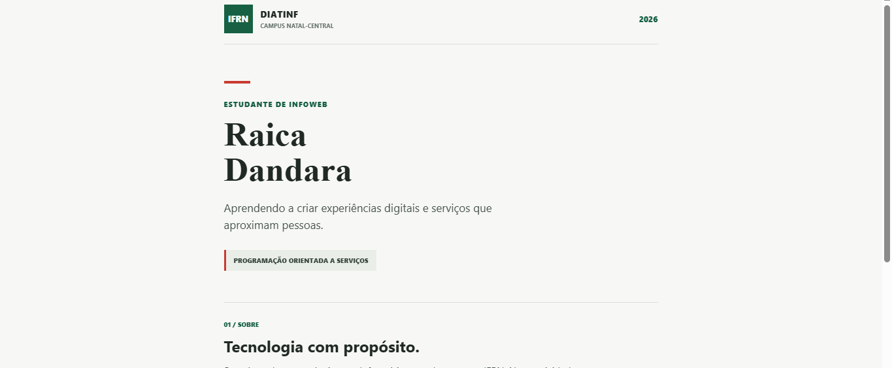

# 2026.3.2 - POS - Frontend mobile

## Informações gerais

- **Público alvo**: alunos da disciplina de **Programação orientada a serviços** do curso de [Infoweb](https://diatinf.ifrn.edu.br/cursos/tecnico-em-informatica-para-internet/) na [DIATINF](https://diatinf.ifrn.edu.br/) no [CNAT-IFRN](https://portal.ifrn.edu.br/campus/natalcentral/)
- **Professor**: [L A Minora](https://github.com/leonardo-minora/)
- **Objetivo**:
  1. Atividade avaliativa para construção de aplicativo com frontend mobile

[A descrição da atividade](atividade.md)

---
## Relato da atividade

### Aluna

**Raica Dandara**

- GitHub: [@RaicaDandara](https://github.com/RaicaDandara)
- LinkedIn: link não informado.

### Aplicativo

Aplicativo mobile desenvolvido com React Native, Expo e TypeScript, localizado em [`web/`](web/).
A tela inicial apresenta o perfil da aluna e informações do curso de Informática para Internet.

Para executar no navegador:

```bash
cd web
npm install
npm run web
```

Para abrir no celular com o Expo Go, execute `npx expo start --tunnel` dentro de `web/` e leia o QR code.

### Frontend mobile no navegador



### Frontend mobile no celular


---
